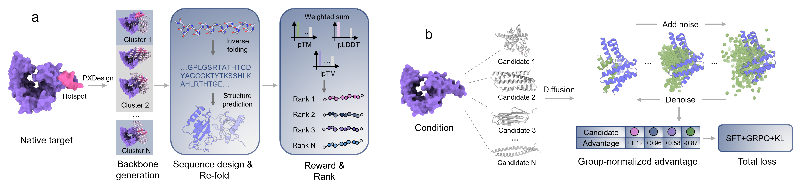

# PBD-RL
PBD-RL is a protein backbone generation method for optimizing the foldability and interface quality of binders, based on PXDesign, through Diffusion-GRPO.



## Installation

- This project is built on PXDesign and only requires the installation of [PXDesign](https://github.com/bytedance/PXDesign).
- You should download the PBD-RL [weight](https://huggingface.co/zengwenwu/PBD-RL).
- If you want to training PBD-RL from scratch, the plug-and-play training dataset is available [here](https://huggingface.co/zengwenwu/PBD-RL) in .jsonl format.
- The raw .CIF file is stored in Zenodo.

## Inference

PXDesign already supports custom checkpoint loading through its underlying inference config. The Click help for `pxdesign infer` does not show every forwarded argument, but the following works:

```bash
pxdesign infer \
  -i /path/to/design.yaml \
  -o /path/to/output \
  --dtype bf16 \
  --N_sample 1 \
  --N_step 400 \
  --eta_type const --eta_min 2.5 --eta_max 2.5 \
  --model_name final \
  --load_checkpoint_dir /path/to/checkpoint_dir \
  --num_workers 0
```

The checkpoint file must be:

```text
/path/to/checkpoint_dir/final.pt
```

Use the config wrapper for reproducible runs:

```bash
cp configs/inference.yaml configs/inference.local.yaml
# edit configs/inference.local.yaml
bash scripts/run_pxdesign_infer.sh configs/inference.local.yaml
```

Check command construction without launching inference:

```bash
bash scripts/run_pxdesign_infer.sh configs/inference.yaml --dry-run
```

The wrapper supports either one input file or a directory of PXDesign YAML/JSON inputs.

## Training Data

Training uses target-group JSONL files. Each line is one target group and contains multiple candidate binders with scalar `score` values. GRPO advantages are computed within each target group.

The default public training recipe uses **iPTM-only reward**:

```text
score = ptx_iptm
```

Build an iPTM-only group file from the integrated metrics TSV:

```bash
python -m pbd_rl.make_prefer_pair.build_groups_from_metrics_tsv \
  --metrics_tsv /path/to/integrated_metrics.flat_paths.tsv \
  --out_dir /path/to/grpo_groups_iptm_only \
  --structure_path_column complex_pdb_path \
  --max_candidates_per_target 24 \
  --min_candidates_per_group 4 \
  --selection_strategy stratified \
  --w_iptm 1.0 \
  --w_ptm_binder 0.0 \
  --w_plddt 0.0 \
  --w_rmsd_log 0.0
```

For the full paper-scale run, use the externally hosted group file:

```text
train_groups.maxatoms5000.iptm_only.jsonl
```

That file is about 296 MB, so it is not committed to GitHub. A tiny smoke/example file is included at:

```text
examples/train_groups.iptm_only.smoke.jsonl
```

The smoke file documents the schema and can run only when its referenced structure paths exist locally.

## Training

Use the iPTM-only config:

```bash
cp configs/train_iptm_only.yaml configs/train_iptm_only.local.yaml
# edit model.load_checkpoint_dir and data.groups_jsonl
```

Single-GPU smoke:

```bash
bash scripts/run_train_iptm_only.sh configs/train_iptm_only.local.yaml --max_steps 2
```

Multi-GPU DDP:

```bash
torchrun --nproc_per_node 6 train.py --config-name train_iptm_only \
  model.load_checkpoint_dir=/path/to/PXDesign/release_data/checkpoint \
  data.groups_jsonl=/path/to/train_groups.maxatoms5000.iptm_only.jsonl \
  experiment.output_dir=/path/to/train_outputs
```

The public default mirrors the iPTM-only run used in our experiments:

```yaml
training:
  epochs: 3
  noise_parallel_steps: 3
  precision: bf16
  amp: true
  lr: 1.0e-6

dpo:
  sft_coef: 5.0e-05

data:
  max_candidates_per_group: 12
  max_atoms_per_group: 4500
```

The final checkpoint is written as:

```text
<experiment.output_dir>/<experiment.run_name>/final.pt
```

## External Artifact Layout

Recommended external release layout:

```text
checkpoints/
  pxdesign_v0.1.0.pt
  grpo_iptm_only/final.pt
  grpo_ptm_only/final.pt
  grpo_balanced/final.pt
datasets/
  binder_grpo_dataset/
  grpo_groups/train_groups.maxatoms5000.iptm_only.jsonl
examples/
  reppi226_yaml/
  pdb2026_yaml/
```

Then point `configs/inference.local.yaml` and `configs/train_iptm_only.local.yaml` to the downloaded paths.

## Cite

Pass.
